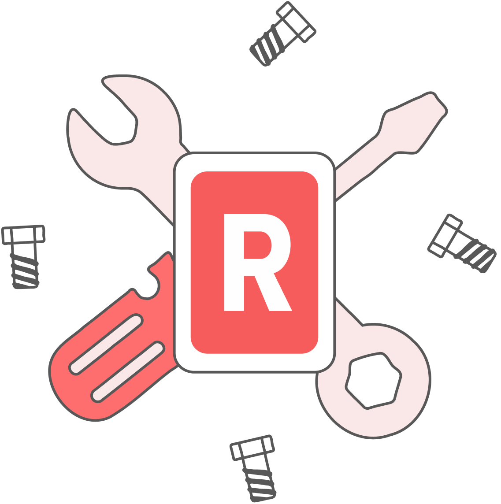

# Congratulations!

You are now well-versed in the skill of building custom `preflight` bundles using predefined `analyzers` found in [troubleshoot.sh](https://troubleshoot.sh/docs/analyze/container-runtime/). 

Up next, Replicated core engineer Dan Stough will guide us in a deep dive into the `support-bundle` component of Troubleshoot.