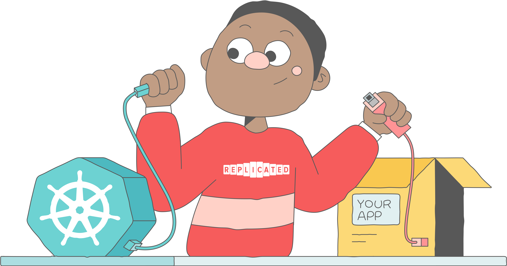

# Congratulations!

Nice! 
You've completed our tour of [troubleshoot.sh](https://troubleshoot.sh/). 
Go forth and have hostile kubernetes clusters bend the knee to your apps!

# Next steps
* Visit [troubleshoot.sh](https://troubleshoot.sh/docs/support-bundle/introduction/) to find out more.
* Visit the [Troubleshoot Github](https://github.com/replicatedhq/troubleshoot) and [contribute](https://github.com/replicatedhq/troubleshoot/blob/master/CONTRIBUTING.md).
* Talk to us in [#troubleshoot-app](https://kubernetes.slack.com/archives/CS7J9JRH9) on Kubernetes slack.
* Stop by our booth (Virtual or IRL) at KubeCon NA 2021. 
